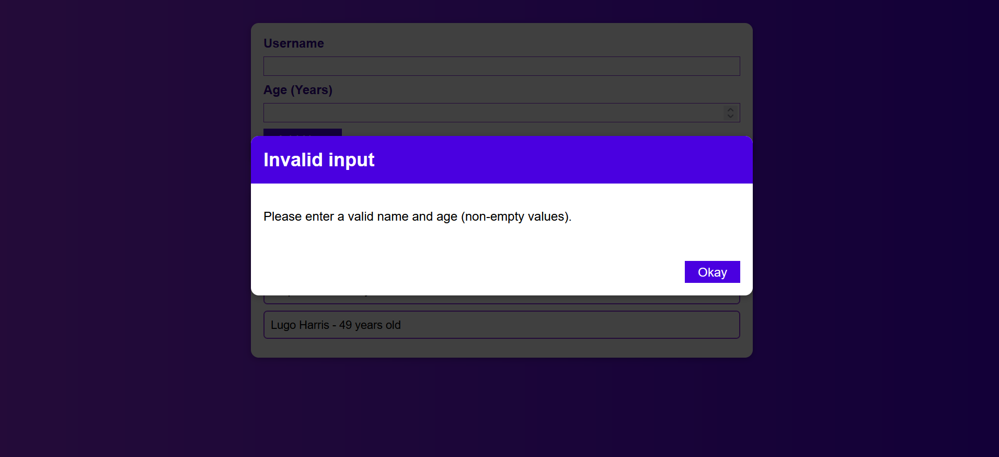
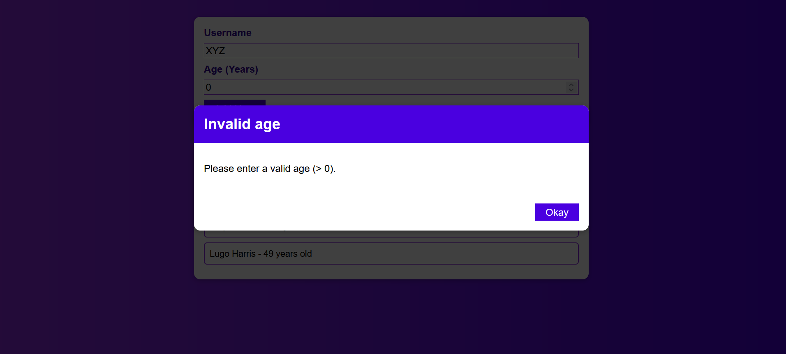

# react-basics-project
##### - React Basics Practice Project - AddUsers
 

AddUsers is a react app which is built using basics features of react. 
 

#### Features and Concepts Used:
1. Working with states and events
2. Lifting up the states
3. Rendering List
4. Rendering conditional contents
5. Styling react apps

 

It displays a list of users. You can input a user's details - username and age, and then the user is added to the users list and rendered.

If also validates username and age, and shows an error modal if a bad input is given.

          

